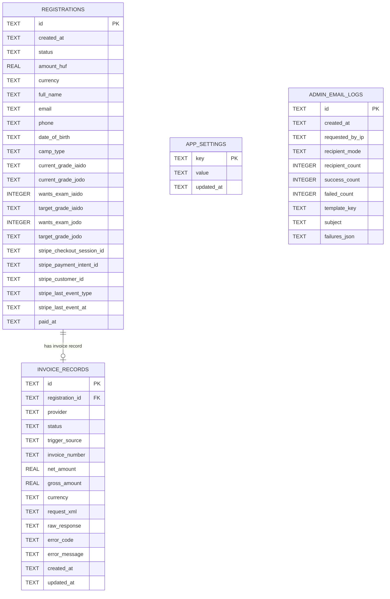

# Ishido Sensei - Summer Seminar 2026

Végleges dokumentáció a jelenlegi rendszerhez.

## Rendszer áttekintés
Az alkalmazás egy teljes tábori weboldal, online regisztrációval, Stripe fizetéssel, Számlázz.hu számlázással, admin felülettel, email kommunikációval és SQLite adattárolással.

Publikus oldalak:
- `/` (Welcome)
- `/info`
- `/program`
- `/faq`
- `/registration`
- `/privacy`
- `/terms`
- `/payment-success`
- `/payment-cancel`

Admin:
- `/admin` (login után)

## Funkciók

### Regisztráció és fizetés
- Regisztrációs űrlap (résztvevő + számlázási adatok).
- Iaido/Jodo csomagválasztás.
- Szerveroldali validáció.
- Élő ármegjelenítés EUR pénznemben.
- Stripe Checkout indítás regisztráció után.
- Stripe webhook alapján státuszfrissítés `PAID`-ra.
- Stripe fizetés megerősítés a success oldalról (`/api/payments/confirm`) webhook késés/miss esetére.
- Stripe azonosítók mentése regisztrációhoz (checkout session, payment intent, customer, utolsó event, paid timestamp).
- Sikertelen fizetés esetén újrafizetési link kezelése.

### Számlázás (Számlázz.hu)
- Automatikus számlalétrehozás Stripe webhook után (`PAID` eseménynél).
- Manuális számlalétrehozás admin API-n keresztül (`POST /api/invoices/create`).
- Duplikáció elleni védelem regisztráció azonosítóra.
- Számlázási eredmények naplózása adatbázisban (`invoice_records`).

### Admin felület
- Jelszó alapú belépés.
- Regisztráltak listája, keresés név/email alapján.
- Részletes jelentkezői adatok lenyitható nézetben.
- Egyéni újrafizetési email küldés adminból (Stripe retry link emailben).
- Státusz alapú törlés (`DELETED`, sor megőrzéssel).
- GDPR anonimizálás (`ANONYMIZED`).
- CSV export.
- Árazás módosítása adminból.
- AAM keret beállítása adminból (EUR), automatikus AAM -> ÁFA váltással számlázáskor.
- Kézi SQLite backup indítás.
- Számla log nézet (Számlázz.hu kérés + válasz hibakereséshez).

### Admin email küldés (SMTP)
- Template alapú és egyedi email küldés.
- Címzett módok:
  - kijelölt címzettek
  - összes aktív
  - csak fizetett
  - csak függő fizetés
- Többes kijelölés, szűrés név/email alapján.
- Kimenő admin email log (`admin_email_logs`).

### Biztonság és stabilitás
- Admin session cookie: `HttpOnly`, `SameSite=Lax`, productionben `Secure`.
- Belépési brute-force védelem: 5 hibás próbálkozás után 15 perc IP alapú tiltás.
- Admin jelszó hash-elve tárolódik (`scrypt` + salt) SQLite-ban.
- Jelszócsere admin felületről, régi sessionök érvénytelenítése.
- Security response headerek aktívak (CSP, nosniff, frame deny, referrer policy, stb.).
- State-changing kérésekre origin ellenőrzés (kivéve Stripe webhook).
- Rate limit a publikus regisztrációra és admin tömeges email küldésre.
- SQLite `busy_timeout` + retry írásnál.
- Automatikus SQLite backup óránként (`data/backups`, állítható perc alapú intervallummal).

## Technikai stack
- Node.js (beépített `http` + `node:sqlite`)
- SQLite
- Stripe API
- Számlázz.hu XML Agent API
- SMTP (POP3/SMTP szerverhez)
- Vanilla HTML/CSS/JS frontend

## Futtatási követelmény
- Node.js `22+`

## Lokális indítás
```bash
npm install
npm run dev
```

Elérhető lesz: `http://localhost:3000`

## Production env bootstrap
```bash
./scripts/create-production-env.sh
```

Ez létrehoz egy `.env.production` fájlt `summerseminar2026.hu` alapértékekkel.

## Szerver telepítés és indítás

Mit kell feltenni a szerverre:
- teljes projekt mappa
- kötelezően szükséges elemek:
  - `server.js`
  - `package.json`
  - `package-lock.json`
  - `public/`
  - `scripts/create-production-env.sh`

Telepítés:
```bash
git clone <repo-url> app
cd app
npm ci --omit=dev
./scripts/create-production-env.sh
```

Ezután töltsd ki a `.env.production` fájlt (Stripe, SMTP, Számlázz.hu, admin jelszó).

Indítás:
```bash
set -a; source .env.production; set +a
npm run start
```

Javasolt éles futtatás PM2-vel:
```bash
npm i -g pm2
set -a; source .env.production; set +a
pm2 start npm --name ishido-camp -- run start
pm2 save
pm2 startup
```

Reverse proxy/domain beállítás:
- `APP_BASE_URL=https://summerseminar2026.hu`
- `TRUST_PROXY=true`
- app futtatás pl. `127.0.0.1:3000` címen, Nginx/Caddy proxyval

Lokális fejlesztéshez javasolt:
```bash
NODE_ENV=development
APP_BASE_URL=http://localhost:3000
TRUST_PROXY=false
```

## Környezeti változók

### Kötelező éles használathoz
```bash
APP_BASE_URL=https://your-domain.com
NODE_ENV=production
TRUST_PROXY=true

ADMIN_PASSWORD=...

STRIPE_SECRET_KEY=...
STRIPE_WEBHOOK_SECRET=...

SZAMLAZZ_ENABLED=true
SZAMLAZZ_AGENT_KEY=...

EMAIL_PROVIDER=smtp
SMTP_HOST=smtp.your-domain.com
SMTP_PORT=587
SMTP_SECURE=false
SMTP_REQUIRE_STARTTLS=true
SMTP_USERNAME=...
SMTP_PASSWORD=...
EMAIL_FROM=no-reply@your-domain.com
EMAIL_FROM_NAME=Ishido Sensei - Summer Seminar
```

### Opcionális
```bash
# If missing, the app auto-generates a strong secret and stores it in SQLite app_settings.
# Recommended in production: set this explicitly as an environment variable.
ADMIN_SESSION_SECRET=...

ADMIN_NOTIFY_EMAIL=you@example.com
ADMIN_EMAIL_MAX_RECIPIENTS=500
REGISTRATION_RATE_LIMIT_COUNT=30
REGISTRATION_RATE_LIMIT_WINDOW_MS=600000
ADMIN_EMAIL_RATE_LIMIT_COUNT=20
ADMIN_EMAIL_RATE_LIMIT_WINDOW_MS=600000

STRIPE_SUCCESS_URL=
STRIPE_CANCEL_URL=

SZAMLAZZ_API_URL=https://www.szamlazz.hu/szamla/
SZAMLAZZ_INVOICE_LANGUAGE=en
SZAMLAZZ_PAYMENT_METHOD=Bankkártya
SZAMLAZZ_AFAKULCS=AAM
SZAMLAZZ_AFAKULCS_OVER_LIMIT=27
SZAMLAZZ_ESZAMLA=true
SZAMLAZZ_SEND_EMAIL=true
SZAMLAZZ_SET_PAID=true
SZAMLAZZ_COMMENT=Ishido Sensei - Summer Seminar 2026
SZAMLAZZ_EXTERNAL_ID_PREFIX=camp-
SZAMLAZZ_REQUEST_TIMEOUT_MS=15000

RETRY_PAYMENT_LINK_TTL_SECONDS=604800

DB_BACKUP_ENABLED=true
DB_BACKUP_INTERVAL_MINUTES=60
DB_BACKUP_DIR=./data/backups
DB_BACKUP_RETENTION_DAYS=30

PORT=3000
```

## API végpontok

Publikus:
- `GET /api/pricing`
- `POST /api/register`
- `POST /api/stripe/webhook`
- `POST /api/payments/create-checkout-session` (retry tokennel)
- `POST /api/payments/confirm` (Stripe session alapú státusz megerősítés)

Admin auth:
- `GET /api/admin/session`
- `POST /api/admin/login`
- `POST /api/admin/logout`
- `POST /api/admin/password`

Admin funkciók:
- `GET /api/stats`
- `GET /api/registrations`
- `GET /api/admin/invoices`
- `GET /api/admin/export.csv`
- `POST /api/admin/backup`
- `GET /api/admin/pricing`
- `POST /api/admin/pricing`
- `GET /api/admin/email/templates`
- `POST /api/admin/email/send`
- `POST /api/admin/registrations/mark-deleted`
- `POST /api/admin/registrations/anonymize`
- `POST /api/admin/registrations/send-retry-payment-email`
- `POST /api/payments/create-checkout-session` (admin manuális)
- `POST /api/invoices/create` (admin manuális számla létrehozás)

## Adatfájlok
- SQLite adatbázis: `data/camp.db`
- Backup könyvtár: `data/backups`
- SQLite WAL mód miatt futás közben megjelenhet:
  - `data/camp.db-wal`
  - `data/camp.db-shm`

## Adatbázis diagram (SQLite)


Megjegyzés az `app_settings` kulcsokról:
- `pricing_settings_v1`: admin árbeállítások JSON formában.
- `admin_auth_v1`: admin jelszó hash + salt + `changedAt` JSON formában.
- `admin_session_secret_v1`: automatikusan generált admin session secret (ha env-ben nincs megadva).

## Deployment megjegyzés (Railway)
- Node 22 szükséges.
- Ha kell: `NIXPACKS_NODE_VERSION=22`
- `TRUST_PROXY=true` ajánlott, hogy a rate limit és IP alapú védelmek a valós kliens IP-n működjenek.
